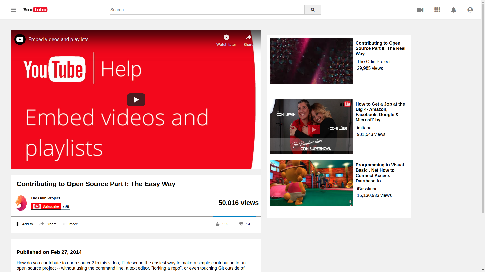

# YouTube Webpage
> Task is to clone YouTube’s video player page using web archive link: http://archive.today/Bss88 as a source page. The goal of this project was to focus on making the media elements show up. We worked on embedding the YouTube video player into the page so it actually plays

 
## Built With

- HTML5
- CSS
- Font Awesome

## Live Demo

[Live Demo Link](https://railona.github.io/youtube-simulator-page/)

👤 **Railon Acosta**

- GitHub: [@railonA](https://github.com/RailonA)

👤 **Sunil Devalla**

- GitHub: [@DsunilK](https://github.com/DsunilK)

## 🤝 Contributing

Contributions, issues, and feature requests are welcome!

Feel free to check the [issues page](https://github.com/RailonA/youtube-simulator-page/issues).

## Show your support

Give a ⭐️ if you like this project!

## 📝 License

This project is [MIT](LICENSE) licensed.

